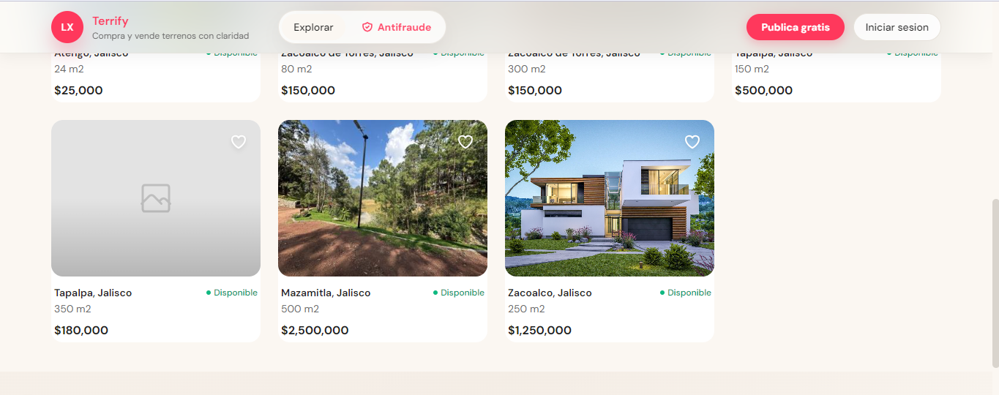
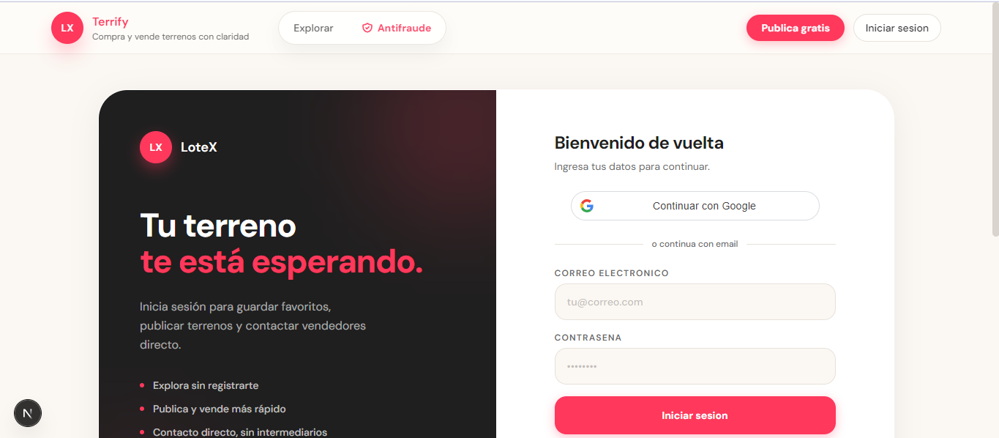

<div align="center">
  <h1>🌱 Terrify</h1>
  <p><strong>Marketplace de terrenos moderno con arquitectura escalable</strong></p>

  <p>
    
    
    
    
    
    
    
  </p>

  <!-- Screenshots -->
  
  
  
</div>

---

## 📋 Índice

1. [Acerca del Proyecto](#-acerca-del-proyecto)
2. [Características Principales](#-características-principales)
3. [Stack Tecnológico](#-stack-tecnológico)
4. [Arquitectura](#-arquitectura)
5. [Primeros Pasos](#-primeros-pasos)
6. [Roadmap](#-roadmap)
7. [Contribuir](#-contribuir)
8. [Licencia](#-licencia)

---

## 📌 Acerca del Proyecto

**Terrify** es un marketplace de terrenos orientado a la experiencia del usuario y transacciones sin fricción. Diseñado para iniciar operativamente en Zacoalco de Torres, Jalisco, con una arquitectura escalable para habilitar un mercado regional y posteriormente global.

### Nuestra Filosofía
> **Exploración pública sin barreras.** El usuario solo necesita registrarse cuando va a ejecutar una acción que aporta valor: publicar un terreno o contactar a un vendedor.

### Público Objetivo
- **Vendedores**: Propietarios de terrenos que desean publicar de forma segura
- **Compradores**: Personas buscando terrenos en la región
- **Agentes**: Profesionales inmobiliarios que gestionan múltiples propiedades

---

## 🎨 Características Principales

| Característica | Descripción |
|-----------------|-------------|
| **Navegación Sin Fricción** | Exploración inmediata sin registro obligatorio |
| **Mobile First** | Diseño adaptativo optimizado para smartphones |
| **Contacto Mediado** | Solicitudes encriptadas y moderadas via panel o email |
| **SSR + ISR** | Renderizado optimizado para SEO y velocidad |
| **Seguridad JWT** | Tokens con rotación, blacklist y rate limiting |

---

## 🛠️ Stack Tecnológico

### Frontend
```
Next.js 14 (App Router)  →  React 18  →  TypeScript  →  TailwindCSS
```

### Backend
```
Django 4.2 + DRF  →  PostgreSQL  →  Redis  →  SimpleJWT
```

### Infraestructura
```
Docker & Compose  →  Cloudinary (imágenes)  →  Resend (emails)
Vercel (frontend)  →  Render (backend)
```

---

## 🏗️ Arquitectura

```
┌─────────────┐     REST API      ┌─────────────┐
│   Frontend  │  ←─────────────→  │   Backend   │
│  (Next.js)  │   (protected)    │  (Django)   │
└─────────────┘                   └──────┬──────┘
                                         │
                                  ┌──────┴──────┐
                                  │  PostgreSQL │
                                  │    Redis    │
                                  └─────────────┘
```

**Principios de diseño:**
- Separación estricta de responsabilidades (SoC)
- API REST protegida sin acceso directo a BD
- Rate limiting y JWT con blacklist
- Políticas CORS/CSP agresivas

---

## 💻 Primeros Pasos

### Prerrequisitos
- Node.js v18+
- Docker y Docker Compose
- Python 3.10+ (opcional)

### Instalación

```bash
# Clonar el repositorio
git clone https://github.com/tu-usuario/terrify.git
cd terrify
```

### Backend (Docker)

```bash
# Iniciar servicios
docker compose up -d db redis backend

# Verificar
docker compose exec backend python manage.py check
```

### Frontend

```bash
cd frontend
npm install
npm run dev
```

**Credenciales**: Copia los archivos `.env.example` a `.env` y configura tus variables.

> ⚠️ **Nota**: La raíz del backend devuelve 404 ya que solo expone API REST.

---

## 🗺️ Roadmap

| Fase | Estado | Descripción |
|------|--------|-------------|
| 1 | ✅ | Arquitectura, API y Base de Datos |
| 2 | ✅ | Autenticación JWT y roles |
| 3 | ✅ | Listado público SSR |
| 4 | ✅ | Gestión de terrenos (CRUD) |
| 5 | ✅ | Dashboard de leads |
| 6 | ✅ | Cloudinary + Resend |
| 7 | 🔄 | Pruebas unitarias |
| 8 | ⏳ | CI/CD con GitHub Actions |
| 9 | ⏳ | Deploy multi-entorno |

---

## 🤝 Contribuir

1. Fork el proyecto
2. Crea una rama (`git checkout -b feature/nueva-caracteristica`)
3. Commit tus cambios (`git commit -m 'Add: nueva característica'`)
4. Push a la rama (`git push origin feature/nueva-caracteristica`)
5. Abre un Pull Request

Para questions, abre un issue.

---

## 📄 Licencia

Este proyecto está bajo la licencia [MIT](LICENSE).

---

<div align="center">
  <small>Desarrollado con ❤️ para empoderar transacciones seguras de bienes raíces.</small>
</div>